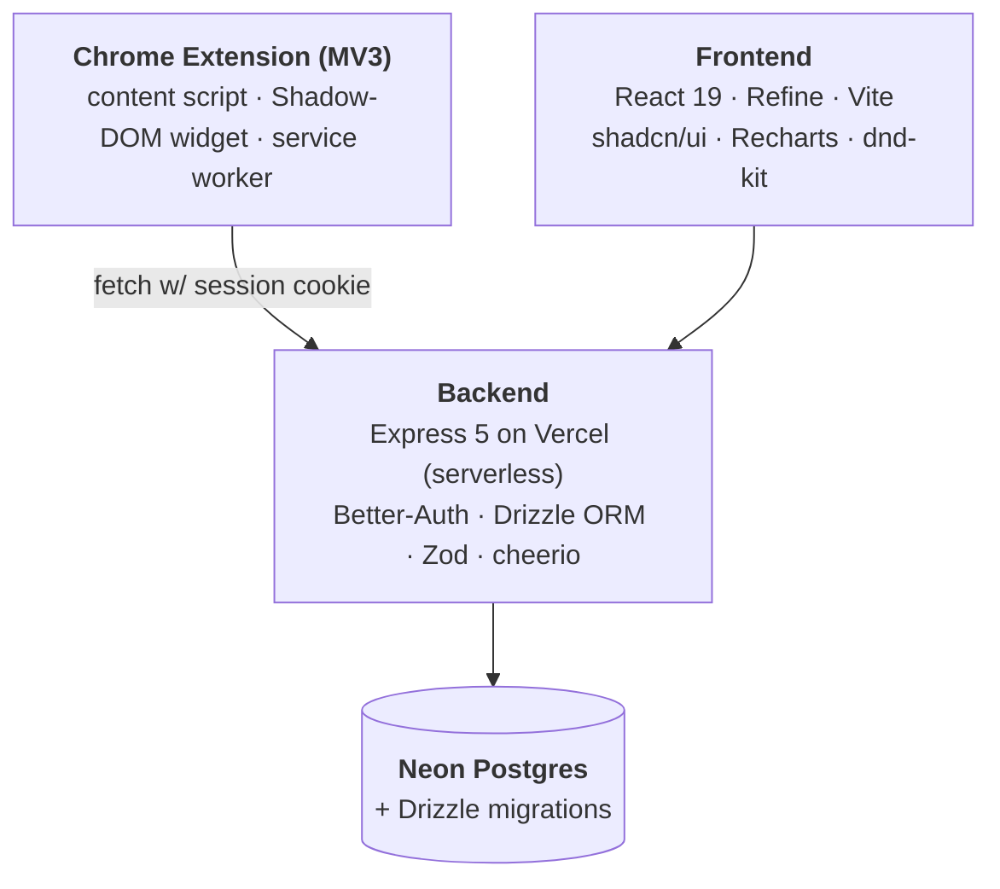

# AppTrack

**A full-stack job application tracker with a Chrome extension that auto-detects when you've applied to a job — turning "I just hit submit" into "this is tracked" with zero clicks.**

**Live:** [apptrack.harshithpeta.com](https://apptrack.harshithpeta.com) &nbsp;·&nbsp; **Stack:** React 19 · TypeScript · Express 5 · PostgreSQL · MV3 Chrome Extension &nbsp;·&nbsp; **Deployed on:** Vercel + Neon

---

## The problem

Modern job hunting means juggling 50–200 applications across LinkedIn, Workday, Greenhouse, Lever, Ashby, and a dozen company ATSes. Spreadsheets rot. Email folders sprawl. By week three, you've lost track of which OAs are due, which recruiters ghosted you, and what your actual interview conversion rate is.

AppTrack collapses the whole pipeline into one product — and the Chrome extension means you never have to remember to log anything.

## What makes it interesting

### Chrome extension with passive auto-detection
The extension runs a content script on every job platform and watches for "Thank you for applying" confirmation pages on LinkedIn, Workday, Greenhouse, Lever, and Ashby. When one fires, it injects a Shadow-DOM widget that lets the user save the application with a single click — no popup, no copy-paste. The widget is style-isolated from the host page (some ATSes ship 2MB of CSS) and authenticates against the backend through the service worker using the user's existing session cookie.

### Server-side job posting scraper
Paste any Greenhouse / Lever / Ashby URL and the backend scrapes company, role, and location server-side using `cheerio` with a JSON-LD `JobPosting` schema fallback. Saves the user from typing the same five fields they just read.

### Analytics that surface what matters today
The dashboard isn't a vanity-metrics wall. It computes a conversion funnel, a 12-week activity heatmap, an action queue (deadlines and follow-ups due in the next 7 days), a weekly cadence chart, and a response-time leaderboard ranking companies by recruiter speed. Built with Recharts on top of aggregated SQL views, cached in memory per-user to survive serverless cold-starts cheaply.

### Built for the way people actually work
- Drag-and-drop kanban (`@dnd-kit`) *and* a sortable table — same data, two mental models.
- `Cmd-K` command palette for navigation and filtering.
- Calendar view of interview dates + OA deadlines on a month grid.
- Every imported row tagged `source = 'manual' | 'url_import' | 'extension'` so the user always knows where data came from.

## Architecture



## Tech stack

| Layer | Tools |
|---|---|
| **Frontend** | React 19, TypeScript, Vite, Refine, shadcn/ui, Tailwind, Recharts, @dnd-kit, GSAP |
| **Backend** | Node.js, Express 5, TypeScript, Drizzle ORM, Zod, Better-Auth |
| **Database** | PostgreSQL (Neon) |
| **Extension** | Manifest V3, vanilla JS, Shadow DOM for style isolation |
| **Infra** | Vercel serverless functions, Neon Postgres, custom domain on Cloudflare DNS |

## Engineering notes worth calling out

- **Auth that spans three origins.** Web app, Chrome extension, and serverless API each have different cookie semantics. Resolved with `SameSite=None; Secure` cookies plus a CORS allowlist that includes the `chrome-extension://` origin.
- **Serverless-aware DB pool.** Drizzle's `postgres-js` driver is configured with `max: 1` so each cold function doesn't open a fresh pool against Neon — important on the free tier, important everywhere.
- **In-memory stats cache** keyed by user with TTL — cheap on warm Vercel invocations, no-op on cold ones, never wrong.
- **Drizzle schema-first migrations** (`npm run db:push`) keep prod and local in sync without managing migration files manually.
- **No `localhost` leaks.** Every URL in the frontend and extension is resolved through a `BACKEND_URL` helper that falls back to `window.location.origin` in prod.

---

## Try it locally

```bash
git clone https://github.com/PetaHarshith/AppTrack.git
cd AppTrack

npm install
npm --prefix Apptrack-frontend install

cp Apptrack-backend/.env.example Apptrack-backend/.env
cp Apptrack-frontend/.env.example Apptrack-frontend/.env
docker compose -f Apptrack-backend/docker-compose.yml up -d
npm run db:push

npm run dev:backend     # → http://localhost:8000
npm run dev:frontend    # → http://localhost:5173
```

Sign up at `localhost:5173/signup` and you're in.

### Loading the Chrome extension
1. `chrome://extensions` → **Developer Mode** on → **Load unpacked** → pick `apptrack-extension/`
2. In the extension's service-worker DevTools:
   ```js
   chrome.storage.sync.set({
     backendUrl: 'http://localhost:8000',
     frontendUrl: 'http://localhost:5173',
   })
   ```

## Repo layout

```
AppTrack/
├── api/                      # Vercel serverless entry → re-exports Express app
├── Apptrack-backend/src/     # Express routes, Drizzle schema, scraper, auth
├── Apptrack-frontend/src/    # React app: pages, dataviz, command palette
├── apptrack-extension/       # MV3 extension: content script, auto-detect, popup
├── vercel.json               # Build + rewrites for serverless deploy
└── docker-compose.yml        # Local Postgres + pgAdmin
```

---

Built by **[Harshith Peta](https://harshithpeta.com)** — Computer Science, University of Wisconsin–Madison.
